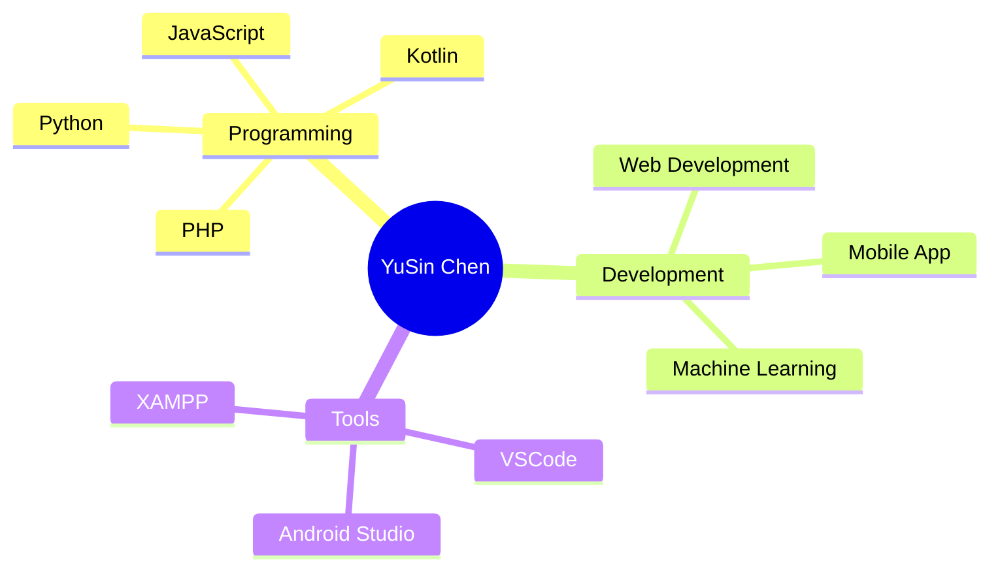

<!-- Banner -->
<p align="center">
  <!--
  
  -->
  
</p>

<h1 align="center">👋 Hi, I'm <strong>YuSin Chen（陳鈺昕）</strong></h1>

<p align="center">
  🌱 <strong>Information Management Student</strong>  \
  🚀 Passionate about Software Development, Web Technologies, and Creative Coding  \
  🎨 Loving clean UI, modern web design, and interactive projects
</p>

<hr/>

<!-- Badges -->
<p align="center">
  
  
  
  
</p>

<br/>

# 🎨 About Me

<details open>
<summary><strong>✨ 點我展開 / 收合 自我介紹</strong></summary>

👋 Hi! I'm **YuSin Chen（陳鈺昕）**,  
a university student majoring in **Information Management**, currently exploring the world of:

- 💻 **Programming & Full-Stack Development**  
- 📱 **Mobile App (Android / Kotlin)**  
- 🎨 **Creative Web Frontend**  
- 🤖 **Machine Learning & Data Projects**

I enjoy building **useful & meaningful tools**, crafting beautiful UI, and turning ideas into real products.

</details>

---

# 🚀 Skills & Technologies

<table>
<tr><th>領域</th><th>技術</th></tr>

<tr>
<td><strong>Languages</strong></td>
<td>Python, JavaScript, PHP, Kotlin</td>
</tr>

<tr>
<td><strong>Web Development</strong></td>
<td>HTML, CSS, React</td>
</tr>

<tr>
<td><strong>Tools</strong></td>
<td>VSCode, XAMPP, Android Studio</td>
</tr>

<tr>
<td><strong>Others</strong></td>
<td>Machine Learning</td>
</tr>

</table>

---

# 🗂️ Featured Projects (Coming Soon)

> 🔧 **未來你可以把你的專案連結放進來，我已幫你保留區塊！**

<details>
<summary><strong>📌 專案作品展示</strong></summary>

### 🎯 專案類型建議（可放這裡）
- Web App  
- Mobile App（Kotlin / Android Studio）  
- 資料分析 / Machine Learning  
- 演算法視覺化  
- 個人網站  

You can add:
```md
### 🔥 My Project Name
🔗 Demo / Code: https://github.com/xxxx  
📌 Technologies: React / Kotlin / Python  
✨ Summary: Use this area to explain your project.
```

</details>

---

# 🧩 Knowledge Map (Mermaid Interactive Diagram)



---

# 🏆 Achievements (Coming Soon)

<details>
<summary><strong>✨ 成就 / 活動 / 證照 區塊</strong></summary>

- 🥇 Competition Awards  
- 📜 Certifications  
- 🎤 Tech Talks / Events  
- 📚 Research / Papers  

</details>

---

# 📬 Contact Me

<p align="center">
  <a href="mailto:yusin@example.com">📧 Email</a> |
  <a href="https://www.linkedin.com/">💼 LinkedIn</a> |
  <a href="https://github.com/YOUR_ID">🐙 GitHub</a>
</p>

---

<p align="center">
  <strong>✨ Thanks for visiting! ✨</strong><br/>
  Always building, always learning. 🚀
</p>
